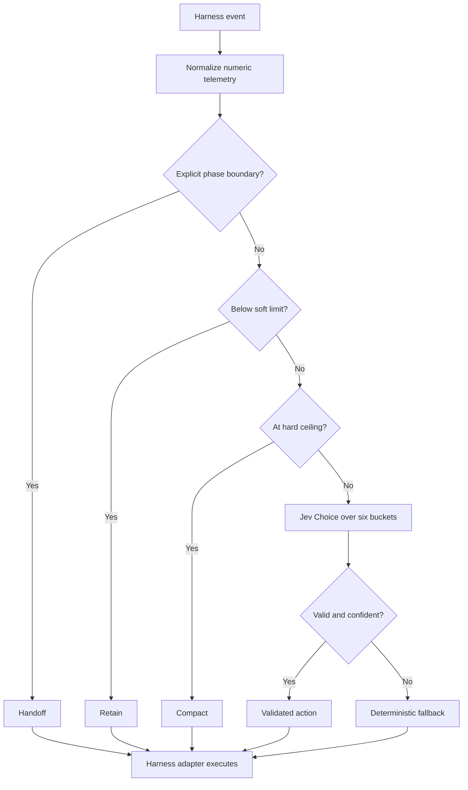

# Spend less context: a portable Jev context-budget hook

Agent harnesses often spend tokens before the agent reads your request. Global
instructions, every installed command, MCP schemas, old turns, and repeated tool output
can all be sent again on each turn. A short request can therefore produce a surprisingly
large input-token bill.

This guide adds a small control loop that decides when to retain a session, compact it, or
start a clean handoff. Exact limits remain deterministic. [TypeSafe Jev][jev] is consulted
only when the right action depends on semantic state such as the current work phase,
repeated failures, and whether cached context is still useful.

The runnable implementation is in [`hooks/context-budget`](../hooks/context-budget).

## What it can and cannot save

The hook can reduce repeated input tokens, prefill latency, and token-metered cost. It
cannot make a model's context window larger, repair a poor summary, or change a provider's
fixed subscription limits. Measure completed-task quality as well as tokens. A cheap run
that loses requirements is not an improvement.

Before adding any classifier, remove static waste:

1. Keep skills and commands project-local when only one project needs them.
2. Connect only the MCP servers required for the current task.
3. Replace duplicate instruction files with one canonical file and small pointers.
4. Load large documentation or source files on demand.
5. Keep one session per work phase instead of one session for an entire project.

The hook manages the context that remains. It does not excuse a bloated startup payload.

## Architecture



Code owns arithmetic, privacy, validation, execution, and the hard stop. Jev supplies one
typed `retain | compact | handoff` judgment in the ambiguous band. This follows
TypeSafe's guidance to keep software in control and use a narrow
[Choice primitive][choice]. Confidence is a concentration measure, not proof that the
decision is correct, so the hook rejects uncertain answers and falls back safely.

## Budget formula

Configure the model contract explicitly:

```text
hard ceiling = context limit - reply reserve - compaction reserve
soft limit   = floor(hard ceiling * 0.63)
fallback     = floor(hard ceiling * 0.84)
```

The supplied ratios are conservative starting points, not universal truth. For a
131,072-token model with a 4,096-token reply reserve and a 49,152-token compaction
reserve, the hard ceiling is 77,824 input tokens. Validate different values with your own
task distribution.

The policy is:

| Condition | Action source | Result |
| --- | --- | --- |
| Explicit phase boundary | Deterministic | `handoff` |
| Below soft limit | Deterministic | `retain` |
| At or above hard ceiling | Deterministic | `compact` |
| Between soft and hard | Jev, if configured | Validated typed choice |
| Jev absent, failed, malformed, or below 0.65 confidence | Deterministic fallback | Retain below fallback, compact at or above it |

## Install

Clone this repository, then install the TypeSafe skill into your agent harness:

```bash
npx skills add typesafe-ai/skills --skill typesafe-ai
```

Select your agent when prompted. The runtime hook itself uses only the Python standard
library, so it has no package dependency.

Never place an API key in a prompt, repository file, command argument, or agent memory.
Expose `TYPESAFE_API_KEY` through your harness's secret store or environment. The hook
does not need a key for deterministic dry runs.

## Try it without API spend

Run this from the repository root:

```bash
python3 hooks/context-budget/context_budget.py <<'JSON'
{
  "input_tokens": 20000,
  "context_limit": 131072,
  "reply_reserve": 4096,
  "compaction_reserve": 49152,
  "turn_count": 8,
  "failed_attempts": 0,
  "phase": "implementation",
  "cache_mode": "warm",
  "phase_boundary": false
}
JSON
```

The result is one JSON object. It recommends an action but never performs compaction or
starts another session.

Add `--use-jev` only after the key is available through a secret-safe environment:

```bash
python3 hooks/context-budget/context_budget.py --use-jev < context-state.json
```

The hook sends Jev only these six bounded fields:

```json
{
  "pressure_band": "advisory",
  "turn_band": "16-30",
  "failure_band": "1",
  "phase": "implementation",
  "cache_mode": "warm",
  "phase_boundary": false
}
```

Prompts, messages, source code, command text, paths, credentials, and transcripts are not
accepted. Unknown input fields make the hook fail closed.

## Connect it to an agent harness

Use an idle, stop, or pre-request event that can observe token usage without placing the
entire transcript in the hook payload. The adapter has three responsibilities:

1. Translate the harness event into the documented input JSON.
2. Run `context_budget.py` and validate its exit status and JSON output.
3. Map `retain`, `compact`, or `handoff` to the harness's native operation.

Keep execution outside the classifier. If a harness cannot compact safely, record the
recommendation and do nothing. Never approximate compaction by deleting arbitrary files
or messages.

The exact hook configuration differs across Codex, Claude Code, OpenCode, Grok, and other
harness versions. Let the target agent inspect its current native hook documentation and
write the smallest adapter rather than copying stale configuration from another harness.

## Give this command to Codex

The repository includes a bounded installation prompt. Run:

```bash
codex exec -C . - < hooks/context-budget/AGENT_PROMPT.md
```

For another coding agent, paste the contents of
[`AGENT_PROMPT.md`](../hooks/context-budget/AGENT_PROMPT.md) into that agent. The prompt
requires the agent to use the TypeSafe skill, inspect the harness's current hook support,
keep secrets out of files, run tests, and report measured before-and-after usage.

## Measure whether it helped

Do not compare one lucky run with one unlucky run. Use at least 20 representative tasks
per configuration and hold the model, repository revision, tools, and task set constant.
Capture:

- input tokens per completed task, with median and p95;
- output tokens per completed task;
- wall-clock duration;
- number of compactions and handoffs;
- task success or eval score;
- regressions caused by missing context.

Compare these three stages separately:

1. Current harness.
2. Static cleanup only, with fewer global commands and MCP schemas.
3. Static cleanup plus the context-budget hook.

This separates the value of ordinary configuration cleanup from the value of Jev. Keep
the hook only if quality stays within your chosen tolerance and input tokens or latency
improve materially.

## Safety checklist

- Keep hard capacity limits in code.
- Use Jev only inside the ambiguous band.
- Send bucketed telemetry, not user or repository content.
- Require an explicit phase boundary before accepting `handoff`.
- Reject redirects, malformed responses, unknown choices, and low confidence.
- Make service failure a normal deterministic fallback.
- Log decisions and token totals, never secrets or raw transcripts.
- Test the adapter against a disposable session before enabling it globally.

## Why Choice fits this problem

The application needs exactly one member of a closed set, so TypeSafe's Choice primitive
matches the interface. The returned probability distribution lets the hook verify option
coverage and the confidence value provides a second gate. The action is still only advice:
typed output guarantees structure, not truth or permission to mutate a session.

[jev]: https://docs.typesafe.ai/concepts/system-one
[choice]: https://docs.typesafe.ai/primitives/choice
[confidence]: https://docs.typesafe.ai/confidence
[api]: https://docs.typesafe.ai/api
